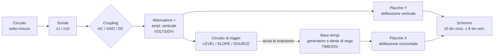
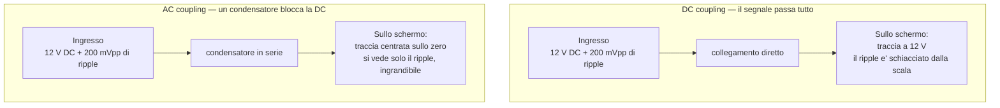

# L'oscilloscopio

> [!info] Dove serve
> **Pratica** (Protti): lo strumento principale di laboratorio. Senza saperlo usare bene, non passi la prova pratica. È la "penna" del tecnico elettronico.

---

## 0. Spiegazione intuitiva (perché?)

> [!tip] Prima di iniziare
> Questo capitolo ti dà le formule e le procedure. **Ma perché funzionano così?** Per le risposte intuitive ("perché ricorsivo, come se spiegassi a un bambino di 4 anni che continua a chiedere perché"), apri il file hub: **[[00 - Perchè (spiegazione intuitiva)]] §13**.

## 1. A cosa serve

L'oscilloscopio è uno strumento che visualizza **tensione in funzione del tempo**. È il "nastro" del laboratorio elettronico.

> [!quote] Il libro, p. 84 (Cap. 3 «L'analisi dei segnali»)
> «*I due modi principali per studiare le caratteristiche di un segnale sono: a) descriverne l'andamento **nel dominio del tempo**, per esempio visualizzandolo con un **oscilloscopio**; b) studiarne lo spettro **nel dominio della frequenza** […] mediante un analizzatore di spettro.*»
>
> È l'unica definizione di ruolo che il libro dà dello strumento: l'oscilloscopio è **la finestra sul dominio del tempo**. Tutto il resto di questa nota viene dalla prassi di laboratorio e dal laboratorio online del corso (vedi §7).

*Schema a blocchi. Il segnale passa per la sonda e l'amplificatore verticale, che comanda la deflessione **verticale**; la base tempi genera la rampa che comanda quella **orizzontale**; il **trigger** decide l'istante in cui ogni scansione parte, ed è ciò che tiene ferma l'immagine.*

---

## 2. I comandi fondamentali

### Verticale (asse Y)

| Comando | Cosa fa |
|---|---|
| **VOLTS/DIV** | Imposta la scala verticale (es. 1 V/div, 100 mV/div) |
| **POSITION** | Sposta la traccia su/giù sullo schermo |
| **AC/GND/DC coupling** | Sceglie come accoppiare il segnale all'ingresso |
| **CH1 / CH2** | Seleziona il canale da visualizzare |
| **ADD/INVERT** | Somma o inverte i due canali |

### Orizzontale (asse X) — Base tempi

| Comando | Cosa fa |
|---|---|
| **TIME/DIV** | Imposta la base tempi (es. 1 µs/div, 1 ms/div) |
| **POSITION** | Sposta la traccia avanti/indietro |
| **X-Y mode** | Disabilita la base tempi; l'asse X mostra un altro segnale (CH2) |

### Trigger

| Comando | Cosa fa |
|---|---|
| **TRIGGER LEVEL** | Imposta la soglia di trigger |
| **TRIGGER MODE** | AUTO, NORMAL, SINGLE |
| **TRIGGER SOURCE** | Quale canale fa da trigger (CH1, CH2, LINE, EXT) |
| **TRIGGER SLOPE** | + = fronte in salita, − = fronte in discesa |

### Sonde

| Tipo | Vista dal circuito | Attenuazione | Impiego |
|---|---|---|---|
| **Sonda ×1** | $1\,\text{M}\Omega \parallel \approx 150$ pF | nessuna | Segnali piccoli e lenti, dove serve tutta l'ampiezza |
| **Sonda ×10** | $10\,\text{M}\Omega \parallel \approx 15$ pF | ÷10 | **Uso normale**: carica 10 volte meno il circuito |

> [!info] Da dove vengono questi numeri
> Sono quelli del **laboratorio Mirandola** (vedi §7): l'oscilloscopio ha $R_i = 1\,\text{M}\Omega$ con in parallelo una capacità $C_i \approx 150$ pF **che comprende anche il cavo della sonda** — non è la sola capacità d'ingresso dello strumento, che da sola è dell'ordine dei 20 pF. La sonda ×10 aggiunge in serie $R_s = 9\,\text{M}\Omega$ (→ 10 MΩ totali) e $C_s \approx 16{,}7$ pF: le due capacità in serie danno $C_s C_i/(C_s + C_i) \approx 15$ pF alla punta.
>
> **Il punto che conta all'orale**: la ×10 non attenua «per fare un dispetto». Attenua perché il partitore che decuplica $R$ e **divide per 10 la capacità vista dal circuito** è lo stesso partitore che divide per 10 il segnale. Meno carico ⇒ meno ampiezza: è un baratto, non un difetto.

> [!danger] Errore classico: sonda ×10 non compensata
> Le sonde ×10 vanno compensate (trimmer $C_s$ al loro interno) alla prima accensione. Se non lo fai, le forme d'onda appaiono distorte e l'ampiezza è sbagliata proprio alle alte frequenze — vedi §7 per il come e il perché.

---

## 3. AC vs DC coupling: la differenza che conta

### DC coupling

- Tutto il segnale (compresa l'eventuale componente DC) passa all'ingresso.
- Vedi la forma d'onda **completa**, offset incluso.

### AC coupling

- Un condensatore interno blocca la componente DC.
- Vedi solo la parte che oscilla attorno alla media; l'eventuale offset è rimosso.

*Stesso segnale, due accoppiamenti. In **DC** vedi la forma d'onda completa, offset incluso; in **AC** un condensatore in serie all'ingresso blocca la componente continua e resta solo la parte che oscilla — che puoi allora espandere con VOLTS/DIV fino a leggerla bene.*

> [!warning]Quando serve AC e quando DC
> - Vuoi misurare il **ripple** di un alimentatore → **AC coupling** (altrimenti il ripple è invisibile sulla pila da 12 V).
> - Vuoi misurare la **tensione DC** di un alimentatore → **DC coupling** (altrimenti vedi zero).
> - Vuoi misurare un piccolo segnale AC sovrapposto a un grande offset → **AC coupling**.

---

## 4. Trigger: come stabilizzare l'immagine

Senza trigger, una sinusoide "scorre" sullo schermo perché la scansione inizia ogni volta in un punto diverso del segnale. Il **trigger** sincronizza l'inizio di ogni scansione con un evento del segnale di trigger, ad esempio "ogni volta che il segnale supera la soglia X andando verso l'alto".

### Modi di trigger

- **AUTO**: trigger automatico; in assenza di trigger la scansione gira comunque in free-running.
- **NORMAL**: trigger solo quando scatta; in assenza di trigger lo schermo resta nero.
- **SINGLE**: una sola scansione; comodo per eventi non ripetitivi.
- **TV**: trigger su segnali video. *(A rigore non è un «modo» come gli altri tre: dentro c'è un separatore di sincronismi che estrae il sync di riga o di quadro da un segnale video composito. Sul pannello degli oscilloscopi analogici però sta sullo stesso selettore di AUTO e NORM — per questo è elencato qui.)*

> [!tip] Il caso "non vedo niente"
> Perché lo schermo è nero con trigger su NORMAL e segnale collegato? Spesso:
> 1. **LEVEL** è al di sopra (o sotto) dell'ampiezza del segnale. Regola il livello.
> 2. **SLOPE** è invertito: prova +/−.
> 3. **SOURCE** è sul canale sbagliato.
> 4. **COUPLING** è su AC con un segnale solo DC.

---

## 5. Misure tipiche

### Tensione

- Misura $V_{pp}$ (picco-picco): conta il numero di divisioni in verticale dalla valle al picco, moltiplica per VOLTS/DIV.
- $V_p = V_{pp}/2$.
- $V_{eff} = V_p/\sqrt{2}$ per sinusoidi pure.

### Periodo e frequenza

- Misura $T$ (distanza tra due fronti dello stesso tipo): conta le divisioni orizzontali, moltiplica per TIME/DIV.
- $f = 1/T$.

### Sfasamento tra due segnali

- Misura la distanza $\Delta t$ tra i punti di passaggio per lo zero di CH1 e CH2 (nello stesso fronte).
- Periodo di riferimento $T$.
- $\varphi = 360° \cdot \Delta t / T$.

### Duty cycle

- Misura il tempo "alto" $t_H$ contro il periodo $T$.
- $\text{Duty} = t_H / T \cdot 100\%$.

### Frequenza di taglio ($f_t$) di un filtro

1. Misura il guadagno in banda passante $G_0$ (a frequenza di riferimento ben sotto $f_t$ per un passa-alto, ben sopra per un passa-basso).
2. Varia la frequenza del generatore finché il guadagno non scende a $G_0 / \sqrt{2} \approx 0{,}707 \cdot G_0$.
3. Quella è la $f_t$ (per -3 dB).

> [!quote] È la procedura del libro — p. 143 (Cap. 4 §2.4, FIGURA 29)
> «*La risposta in ampiezza e la risposta in fase di un quadripolo possono essere facilmente rilevate in laboratorio: è sufficiente porre in ingresso una **sinusoide di una data ampiezza** e misurare, mediante un **oscilloscopio**, i valori dell'**ampiezza** e dello **sfasamento** del segnale d'uscita, **al variare della frequenza**.*»
>
> Quindi le due misure qui sopra — ampiezza per la $f_t$, $\Delta t$ per lo sfasamento — non sono due esercizi separati: sono **il modo in cui si rileva sperimentalmente la $G(j\omega)$** studiata in [[Filtri passivi del primo ordine]]. Punto per punto in frequenza, si costruisce il diagramma di Bode a mano.

---

## 6. Bande tipiche degli oscilloscopi

| Tipo | Banda | Impiego |
|---|---|---|
| **Audio** | 20 MHz | Basse frequenze, audio, ripple di alimentatori |
| **General purpose** | 100–200 MHz | Buona parte dei circuiti ITIS |
| **Digitale ad alta velocità** | 500 MHz–1 GHz | Circuiti digitali veloci, RF |

> [!warning] Banda insufficiente = misure sbagliate
> Se la banda dell'oscilloscopio è inferiore alla massima frequenza del tuo segnale, la forma d'onda ti appare con slew-rate ridotto e ampiezza ridotta. Verifica sempre che la banda sia almeno 5× la massima frequenza del segnale che stai misurando.

---

## 7. La differenza tra sonda ×1 e sonda ×10

La sonda ×10 ha un partitore interno che riduce di 10 il segnale all'ingresso dell'oscilloscopio. Il vantaggio è che la **resistenza vista dal circuito sale a 10 MΩ** e la **capacità scende a ~15 pF**: la sonda "pesa" di meno sul circuito da misurare.

### Perché serve il trimmer: il partitore compensato

> [!quote] Laboratorio Mirandola online — «La cancellazione polo-zero nella sonda dell'oscilloscopio»
> «*Un oscilloscopio presenta di solito una resistenza d'ingresso $R_i = 1\ \text{M}\Omega$ con in parallelo una capacità parassita pari a circa $C_i = 150$ pF, dovuta all'oscilloscopio e al cavo della sonda.*»
> «*Il circuito costituito da $R_s$, $R_i$ e $C_i$ presenta un **polo** e si comporta da **filtro passa basso**, limitando la banda passante dello strumento e distorcendo in ampiezza i segnali da visualizzare.*»

Il problema è qui: un partitore **solo resistivo** ($R_s = 9\ \text{M}\Omega$ verso $R_i = 1\ \text{M}\Omega$) divide per 10 in continua, ma appena il segnale sale in frequenza la $C_i$ da 150 pF cortocircuita $R_i$ e il rapporto di partizione **cambia con la frequenza**. Risultato: un passa basso involontario in serie alla tua misura.

La cura è mettere un condensatore variabile $C_s$ **in parallelo a $R_s$**, che introduce uno **zero** che cancella il polo:

$$\boxed{R_s C_s = R_i C_i}$$

$$C_s = \frac{R_i C_i}{R_s} = \frac{10^6 \cdot 150 \cdot 10^{-12}}{9 \cdot 10^6} = 16{,}7\ \text{pF}$$

Con questa condizione la funzione di trasferimento diventa **costante a $1/10$ a ogni frequenza**, da 0 a infinito: il partitore è detto **compensato**. È esattamente il *pole-zero cancellation* — la stessa idea dei filtri del [[Filtri passivi del primo ordine]], usata al contrario per **non** filtrare niente.

> [!tip] Regola di calibrazione della sonda ×10
> Sulla sonda c'è un **trimmer** che regola $C_s$. Per tararlo:
> 1. Collega la sonda all'uscita **CAL** (un'onda quadra di riferimento).
> 2. Agisci sul trimmer fino a che l'onda quadra appare **perfettamente squadrata**: fronti netti e **tetti orizzontali**.
>
> | Cosa vedi sul tetto dell'onda quadra | Diagnosi | Cosa è successo |
> |---|---|---|
> | Fronte **arrotondato**, sale piano verso il tetto | **SOTTO**compensata ($C_s$ troppo piccola) | $R_sC_s < R_iC_i$: le alte frequenze sono attenuate, il polo non è cancellato |
> | **Sovraelongazione** (gobba/punta) e poi rientro | **SOVRA**compensata ($C_s$ troppo grande) | $R_sC_s > R_iC_i$: le alte frequenze sono esaltate |
> | Tetto piatto | compensata ✔ | $R_sC_s = R_iC_i$ |

> [!question] Perché proprio un'onda quadra, e non una sinusoide?
> Perché l'onda quadra contiene **tante armoniche insieme**: «*l'elevato numero di armoniche contenute nell'onda quadra consente la verifica istantanea di tutta la banda di frequenze in cui deve essere utilizzato l'oscilloscopio*» (laboratorio Mirandola). Con una sinusoide verificheresti **una** frequenza per volta.
>
> È la stessa ragione per cui il libro usa l'onda quadra per studiare i transitori — **p. 139** (Cap. 4 §2.3, FIGURA 24): «*Per poter visualizzare più agevolmente la risposta al gradino di un quadripolo sull'oscilloscopio, si pone in ingresso un'**onda quadra**, che non è altro che una successione di gradini*». Un'onda quadra è un gradino che si ripete: perfetta sia per vedere un transitorio, sia per tarare una sonda.

---

## 8. Da qui in poi

- Per la prova pratica: [[03 - Prova Pratica Protti]]
- Per le misure su amplificatori: [[Amplificatori a BJT]]
- Esercizi: inclusi in [[Esercizi - Amplificatori a BJT]]
- Perché funziona così: [[00 - Perchè (spiegazione intuitiva)]] §13

**Riferimenti libro**: l'oscilloscopio **non ha una sezione propria** nelle 152 pagine scansionate (pp. 48-427). Il libro lo cita di passaggio a **p. 84** (Cap. 3 «L'analisi dei segnali» — tempo vs frequenza), a **p. 139** (Cap. 4 §2.3, FIGURA 24 — onda quadra per la risposta al gradino) e a **p. 143** (Cap. 4 §2.4, FIGURA 29 — rilievo di ampiezza e sfasamento). La **sonda compensata** è invece trattata per esteso nel laboratorio online dello stesso corso: Mirandola, *La cancellazione polo-zero nella sonda dell'oscilloscopio (partitore compensato)*, © 2012 Zanichelli. Dettagli e link in [[00 - Fonti e note]].
